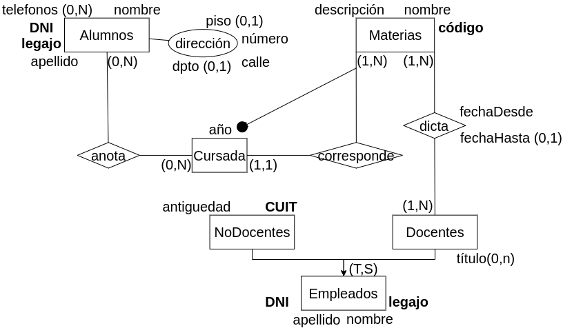

## Modelo Conceptual ER
### Componentes
- Entidades 
- Relaciones
- Atributos

### Entidades:
Representa un elemento u objeto del mundo real con identidad
- Se diferencia de cualquier otro objeto o cosa.
- Ejemplos
 
**Conjunto de entidades:** Representación que, a partir de las características própias de cada entidad con propiedades comunes, se resume en un núcleo.

### Atributos:
Representa una propiedad básica de una entidad o relación. Es el equivalente a un campo de un registro.

**Compuesto:** Representa a un atributo generado a partir de la combinación de varios atributos simples.

**Identificador:** Es un atributo o conjunto de atributos que permite reconocer o distinguir a una entidad de una manera unívoca dentro del conjunto de entidades.

- Compuesto: Conformado por más de un atributo.
- Externo: Conformado por atributos que pertenecen a otra endidad

**Cardinalidad:** Los atributos tienen asociado el concepto de cardinalidad. Cuando se define un atributo se debe indicar si es o no obligatorio y si puede tomar más de un valor (polivalente).

- **(1,1): monovalente - obligatorio**. La cardinalidad existe y está presente, pero solamente en éste caso no se indica en forma explícita.
- **(0,1): monovalente - no obligatorio**
- **(0,n): polivalente - no obligatorio**
- **(1,n): polivalente - obligatorio**

### Relaciones:
Representan agregaciones entre dos (binaria) o más entidades. Describen las dependencias o asociaciones entre dichas entidades.

**Conjunto de Relaciones:** Es una representación que, a partir de las características propias de cada relación existente entre dos entidades, las resume en un núcleo.

**Tipos:**

- Binarias
- Ternarias
- N-arias
- Recursiva

**Cardinalidad:** Es el nivel de correspondencia entre las entidades que se relacionan. Se debe definir el nivel mínimo de correspondencia, (cardinalidad mínima), y el nivel máximo de correspondencia (cardinalidad máxima).

### Jerarquía de Generalización:
Permiten extraer propiedades comunes de varias entidades o relaciones, y generar con ellas una super-entidad que las aglutine. Así las características compartidas son expresadas una única vez en el modelo, y los rasgos específicos de cada entidad quedan definidos en su sub-entidad.

- **Relaciones de jerarquía total**. Una cobertura es total cuando cada elemento del padre está contenido en alguno de los hijos.
	
- **Relaciones de jerarquía parcial**. Pueden existir elementos del padre que no se instancien sobre los hijos.
	- La suma de los elementos de los hijos pueden no dar la totalidad de los elementos del padre.
	- Puede haber una instancia de la clase padre que no esté relacionada con sus hijas.
	
- **Relaciones de jerarquía exclusiva**. Cada registro del supertipo solo puede estar asociado con un solo subtipo a la vez. O es de un tipo de subtipo o del otro (no puede haber solapamiento  en la especialización).
	- Los elementos en los hijos nunca se van a superponer 
	- Sería un hijo o el otro.

- **Relaciones de jerarquía superpuesta**. Un registro del supertipo puede estar asociado con múltiples subtipos al mismo tiempo. Esto permite que las especializaciones se superpongan, lo que significa que un registros puede tener características de más de un subtipo.
	- Puede haber superposición en los elementos de los hijos.
	- Puede ser un hijo y el otro a la misma vez.

**Coberturas posibles**

- **(T,E)**: total-exclusiva
- **(P,E)**: parcial-exclusiva
- **(T,S)**: total-superpuesta
- **(P,S)**: parcial-superpuesta

### Subconjuntos: 
Caso especial de las jerarquías de generalización de la que se desprende solamente una especialización. No es necesario indicar la cobertura para los conjuntos.

- La cobertura siempre va a ser parcial al ser un subconjunto de la clase padre.

### Ejercicio Integrador:

Se desea modelar la información referente a los alumnos de la facultad de informática. De los alumnos se conoce su DNI, Legajo, nombre y apellido dirección detallada y teléfono/s.

Además se conoce información sobre las materias que se dictan en al facultad. De las materias se conoce código único de materia, nombre y descrpción. Es importante representar las cursadas de cada materia. De cada cursada se sabe el año en que se dicta y a que materia corresponde. Una materia se cursa una única vez por año. Un alumno se puede inscribir a una o varias materias.

Además es necesario modelar a los empleados de la facultad. De los empleados se conoce DNI, nombre, apellido y legajo. De los empleados docentes además se conoce el título (puede no tener título o tener más de uno) y las materias que dicta. El docente puede rotar de materia, por lo que es necesario representar el historial de materias por el que pasó. Por otro lado, de los empleados no docentes es necesario representar CUIT y antiguedad.

- Puede haber una entidad Persona que sea padre de las entidades Empleados y Alumnos con cobertura (T,E).

- Como una materia se da una única vez en el año podemos crear el identificador externo que relacione el código de materia y el año de la cursada.
	- La creación de un identificador externo, debe darse naturalmente (no forzada) con una entidad débil (1,1).
	
- No colocamos una relación entre alumno y materia porque perdemos la información de en que año cursó un alumno.
	- Con Cursadas como entidad no perdemos esa información porque tenemos una cardinalidad de (1,1) por parte de Materias.
	
- Si coloco fechaDesde y fecha Hasta en Docente no puedo saber a que materia corresponde. Lo mismo ocurre con Materias, no puedo saber el docente que la dictó.
	- fechaHasta siempre es opcional.
