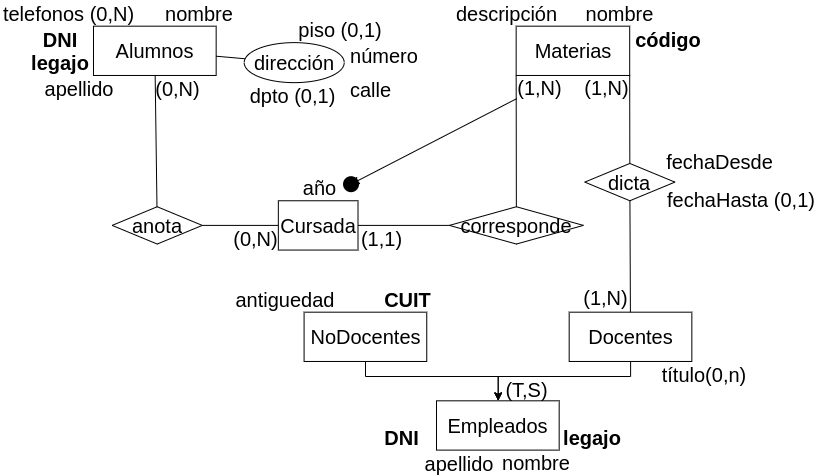
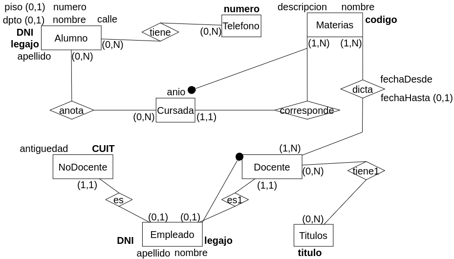

<h2 align="center">Decisiones sobre el modelo Lógico</h2>

### Introducción
El propósito de la generación de un modelo ER Lógico es convertir el esquema conceptual a un modelo más cercano a la representación entendible por el SGBD (Motor de Bases de Datos).

### Resolver Jerarquías
El modelo relacional no soporta el concepto de herencia; por consiguiente, las jerarquías no pueden ser representadas.

- **Total Exclusiva (T,E):** Hay tres posibilidades.

- **Total Superpuesta (T,S):** Dos posibilidades. 
	- Dejar todo o dejar solo al padre.
	- No se puede eliminar el padre.
	
- **Parcial Exclusiva (P,E):** Dos posibilidades. 
	- Dejar todo o dejar solo al padre.
	- No se puede eliminar el padre
	
- **Parcial Superpuesta (P,S):** Dos posibilidades. 
	- Dejar todo o dejar solo al padre.
	- No se puede eliminar el padre

**Opciones para resolver Jerarquías**

- _Dejar todas las entidades:_ 
	- Si las entidades hijas no tienen identificador propio, debo bajarlo desde el padre como identificador externo. Caso contrario es opcional.
	- La cardinalidad del padre siempre es (0,1).
	- La cardinalidad de los hijos siempre es (1,1).
	
- _Dejar solo al padre:_
	- Todos los atributos de los hijos pasan al padre.
	- Deben pasar como no obligatorios (0,1). Idem las relaciones en los hijos pasan como relaciones opcionales (mínima 0).
	- Si en el hijo era un atributo identificador, debe dejar de serlo. (Nunca un identificador puede ser opcional).
	
- _Dejar solo a los hijos:_
	- Se deben bajar los atributos del padre a cada uno de sus hijos.

### Resolver Atributos Compuestos

1. Generar un **único atributo** que se convierta en la concatenación de todos los atributos simples que contiene el atributo compuesto. Esta solución es simple y sencilla de implantar, pero al unir todos los atributos simples que forman el compuesto, se pierde la identidad de cada atributo simple.

2. Definir todos los atributos **como simples**. Permite al usuario definir cada uno de los datos en forma independiente, siendo la solución más indicada.

3. Generar una **nueva entidad**, conformada por cada uno de los atributos simples que contiene. Debe estar relacionada con la entidad a la cual pertenecía el atributo compuesto. Capta mejor la esencia del atributo, pero es una opción más compleja.

### Resolver Atributos Polivalentes
Ningún SGBD relacional permite que un atributo contenga valores múltiples determinados dinámicamente. Es decir, se puede tener un atributo con múltiples valores, pero la cantidad máxima debe ser previamente determinada.

- Se quita el atributo polivalente generando una entidad y una interrelación.

- Si todos los atributos de entidades y relaciones son atributos simples se dice que el modelo está en **Primera Forma Normal (1FN)**.
	- El modelo no tiene atributos polivalentes.
	

### Ejercicio Integrador:

Se desea modelar la información referente a los alumnos de la facultad de informática. De los alumnos se conoce su DNI, Legajo, nombre y apellido dirección detallada y teléfono/s.

Además se conoce información sobre las materias que se dictan en al facultad. De las materias se conoce código único de materia, nombre y descrpción. Es importante representar las cursadas de cada materia. De cada cursada se sabe el año en que se dicta y a que materia corresponde. Una materia se cursa una única vez por año. Un alumno se puede inscribir a una o varias materias.

Además es necesario modelar a los empleados de la facultad. De los empleados se conoce DNI, nombre, apellido y legajo. De los empleados docentes además se conoce el título (puede no tener título o tener más de uno) y las materias que dicta. El docente puede rotar de materia, por lo que es necesario representar el historial de materias por el que pasó. Por otro lado, de los empleados no docentes es necesario representar CUIT y antiguedad.

