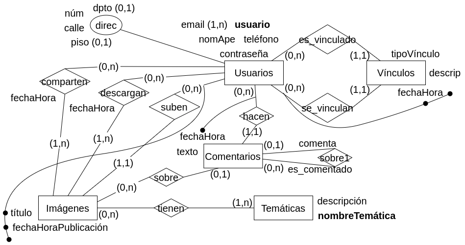
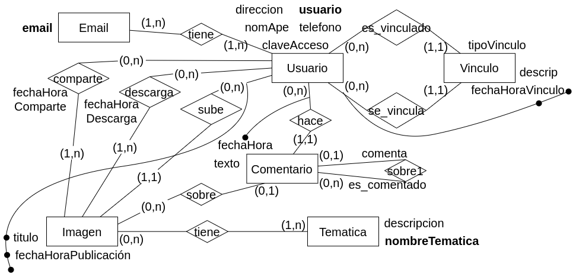

#### 2. Se desea modelar la información necesaria para una red social. 

La red social permite a los usuarios compartir imágenes de diferentes temáticas y realizar comentarios sobre las mismas. De los usuarios se registran: nombre y apellido, usuario en la red social (que es único), clave de acceso, cuentas de correo electrónico, dirección detallada y un teléfono de contacto.

En la red social, los usuarios pueden subir imágenes, o bien comentar, descargar o compartir una publicación (imagen) de otros usuarios vinculados.

Cuando dos usuarios se vinculan, se debe almacenar información de este vínculo: fecha y hora, tipo de vínculo y opcionalmente una descripción estandarizada en la red social que indica de donde se conocen (lugar de vínculo). En la misma fecha y hora el mismo usuario no podrá generar dos vínculos.

De las imágenes se debe almacenar: fecha y hora de publicación, temática de la imagen, título, usuario que realiza el posteo y el nombre del archivo correspondiente, además de un conjunto de palabras claves que caracterizan la imagen. Un usuario no puede subir dos imágenes con título idéntico. De las temáticas se registra un nombre único y una descripción asociada.

De las imágenes se debe poder determinar los usuarios que compartieron la imagen o la descargaron, indicando fecha y hora y si la compartió o descargó.

Así mismo, los usuarios pueden realizar comentarios en la red social, se debe almacenar un texto, la fecha y hora de creación del comentario, que imagen comentó o a que comentario respondió. Un comentario podría ser respuesta a otro comentario existente. Un usuario no podrá realizar dos comentarios en la misma fecha y hora. 

### Modelo ER Conceptual.

### Modelo ER Lógico.

### Modelo Físico Relacional.

- Usuario = (<u>usuario</u>, direccion, nomApe, telefono, claveAcceso)

- Email = (<u>email</u>)

- Vinculo = (<u>fechaHoraVinculo, usuario(fk)</u>, descripcion, tipoVinculo, usuarioSolicitado(fk))

- Imagen = (<u>titulo, fechaHoraPublicacion, usuario(fk)</u>)

- Comentario = (<u>fechaHoraComentario, usuarioComenta(fk)</u>, fechaHora)

- Tematica = (<u>nombreTematica</u>, descripcion)

- tiene_tematica = (<u>(usuario, titulo, fechaHoraPublicacion)(fk), nombreTematica(fk)</u>)

- tiene_email = (<u>email(fk), usuario(fk)</u>)

- sobre_imagen = (<u>fechaHoraComentario, usuario(fk)</u>, titulo, fechaHoraPublicacion, usuario)

- sobre_comentario = (<u>fechaHoraComentario, usuario(fk)</u>, fechaHoraComentarioResponde, usuarioResponde(fk))

- comparte = (<u>(titulo, fechaHoraPublicacion, usuarioSube)(fk), usuarioComparte(fk)</u>, fechaHoraComparte)

- descarga = (<u>(titulo, fechaHoraPublicacion, usuarioSube)(fk), usuarioBaja(fk)</u>, fechaHoraDescarga)

