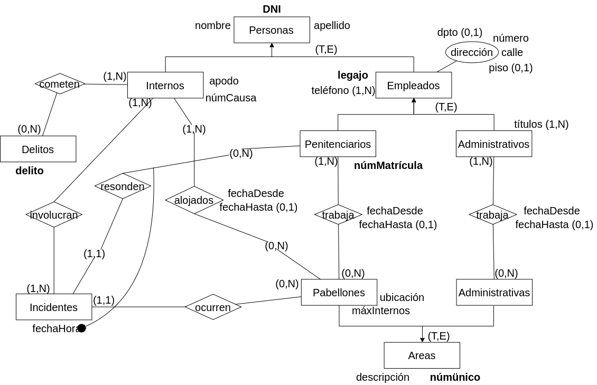
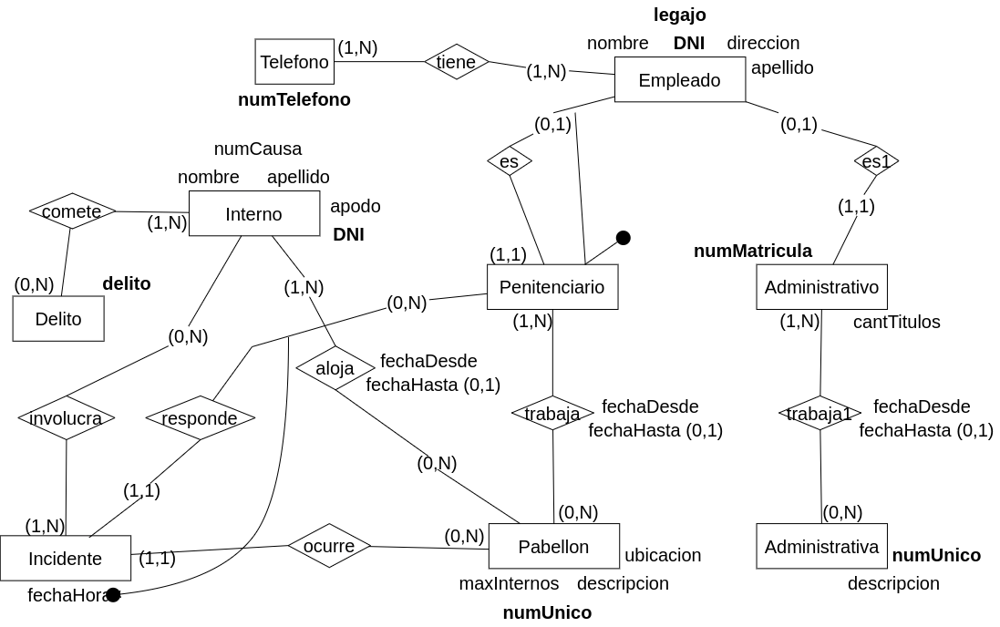

**3.** Se desea modelar una base de datos para el manejo de una unidad del servicio penitenciario (cárcel en lenguaje coloquial). En la unidad trabajan empleados de los cuales se conoce nombre, apellido, dirección completa, legajo (único), D.N.I, teléfonos y el área donde trabaja. Cada empleado puede trabajar en una única área a la vez pero puede a lo largo del tiempo trabajar en las diferentes áreas, se debe modelar el historial de áreas en donde ha trabajado un empleado. Existen dos tipos de áreas, las áreas administrativas y los pabellones. En las áreas administrativas trabajan solo empleados administrativos y en los pabellones solo empleados penitenciarios. Un empleado administrativo no puede ser penitenciario. Además de los empleados penitenciarios es necesario conocer el número de matrícula el cual es único. Los empleados administrativos pueden tener uno o varios títulos.

De los internos se conoce, nombre, apellido, apodo, número de causa (puede ser compartida por varios internos), listado estandarizados de delitos en esa causa y D.N.I. Los internos son alojados en pabellones, es necesario conocer el pabellón donde se encuentra un interno. Si un interno es movido a otro pabellón debe quedar registrado el historial. De los pabellones se conoce, número único de pabellón, ubicación, cantidad máxima de internos y una descripción. Las áreas administrativas tienen un número único y una descripción.

Por último es necesario registrar los posibles incidentes ocurridos en la unidad detallando fecha y hora del incidente, internos involucrados, descripción del incidente, el pabellón donde ocurrió y el penitenciario responsable.

### Modelo ER Conceptual

### Modelo ER Lógico

### Modelo Físico Relacional

- Empleado = (<u>DNI</u>, nombre, apellido, direccion)
- Penitenciario = (<u>DNI</u>)
- Administrativo = (<u>numMatricula</u>, DNI(fk) titulos)
- Telefono = (<u>numTelefono</u>)
- Pabellon = (<u>numUnico</u>, maxInternos, descripcion, ubicacion)
- Administrativa = (<u>numUnico</u>, descripcion)
- Interno = (<u>DNI</u>, nombre, apellido, apodo, numCausa)
- Delito = (<u>delito</u>)
- Incidente = (<u>DNI, fechaHora</u>, DNI(fk), numUnico(fk))
- tiene = (<u>numTelefono, DNI</u>)
- trabaja = (<u>DNI, numUnico, fechaDesde</u>, fechaHasta?)
- trabaja1 = (<u>numMatricula, numUnico, fechaDesde</u>, fechaHasta?)
- aloja = (<u>DNI, numUnico, fechaDesde</u>, fechaHasta?)
- involucra = (<u>DNI, fechaHora, DNI</u>)
- comete = (<u>delito, DNI</u>)

