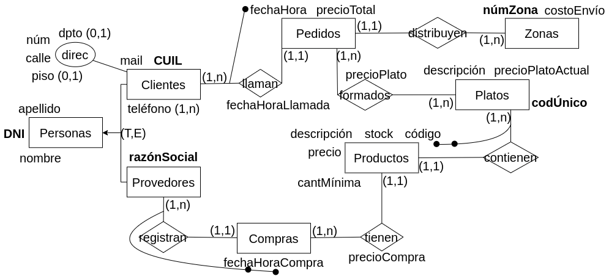
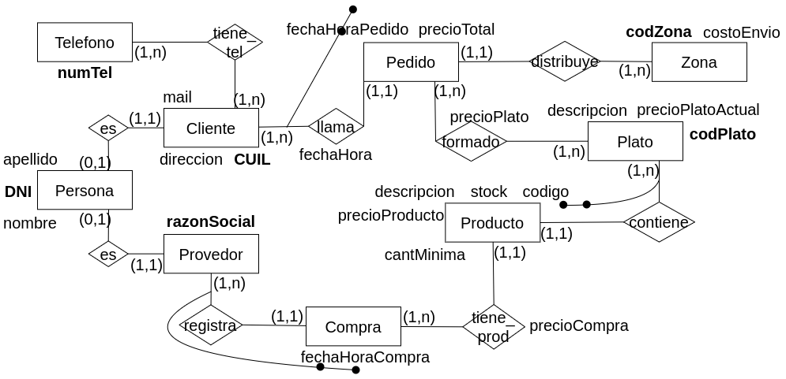

#### 4.  Se desea modelar el manejo de la información referente a una casa de comidas.

De los clientes se conoce D.N.I, apellidos, teléfonos, dirección detallada, mail y CUIL. La casa vende diferentes platos de los que se conoce código único, precio actual y
descripción.

Cuando un cliente llama, se le toma el pedido, el cual puede estar formado por uno o varios platos. Debe quedar registro de la fecha y hora que se realizó el llamado, la fecha y hora de entrega del pedido, el precio total y los precios que fue vendido cada producto. Los repartos se realizan por zonas, conociéndose de cada zona el número único de zona y el costo de envío hasta esa zona. Es necesario poder obtener el costo de envío de un pedido dado.

Por otro lado, debemos modelar la reposición de materia prima con la que se elaboran los platos. Cada plato está formado por varios productos de los que se conoce código, descripción, precio actual, stock y cantidad mínima. Se realizan compras de productos a proveedores de los cuales se conoce nro único de proveedor, D.N.I, nombre, apellido y razón social (único). Por cada compra debemos poder obtener los productos involucrados, el proveedor, la fecha, la hora y el precio al que se compró cada producto.

**Nota:** tenga en cuenta que se podría pedir: obtener los productos que conforman cada plato como así también aquellos pedidos que fueron entregados, los pedidos que fueron rechazados, pedidos mayores a $10000 y los pedidos que se encuentran pendientes, entre otras estadísticas y consultas.

### Modelo ER Conceptual

### Modelo ER Lógico

### Modelo Físico Relacional

