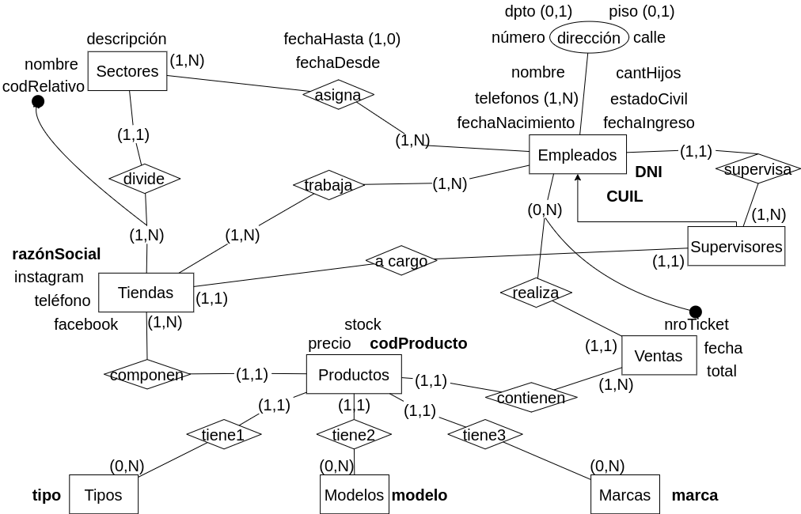
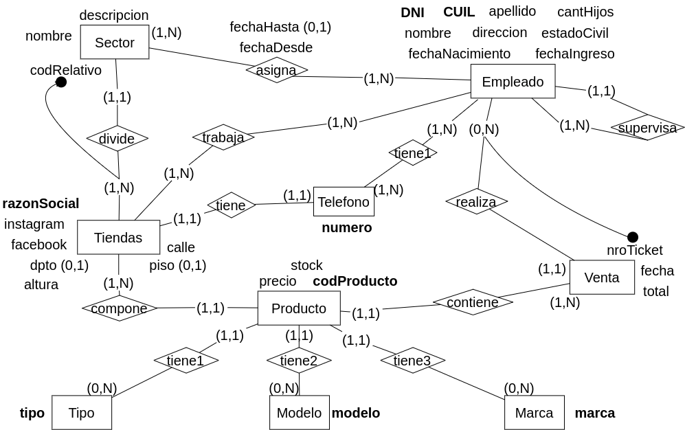

**5.** Se desea modelar la información necesaria para una cadena de tiendas de indumentaria. De cada tienda se desea almacenar: la razón social, su dirección completa, un teléfono de contacto, instagram y facebook de la misma (si posee). Las tiendas están conformadas por un grupo de empleados y un supervisor a cargo de la misma. De los empleados se registran: DNI, CUIL, nombre, apellido, fecha de nacimiento, dirección, uno o varios teléfonos de contacto, fecha de ingreso, cantidad de hijos y estado civil.

Las tiendas están divididas en sectores de trabajo: personal, proveedores, ventas, entre otros. De cada sector se registra nombre, descripción y un código único relativo a la tienda, el mismo código de sector puede estar en varias tiendas. Cada empleado está asignado a un sector determinado pero con el transcurso del tiempo va cambiando de
sector; se debe poder determinar los sectores por los que pasó un empleado en orden cronológico. Cada empleado trabaja en una y solo una tienda. El supervisor sólo podrá estar a cargo de una tienda.

De los productos que se comercializan en las tiendas se debe registrar: tipo de producto, marca, modelo, talle, descripción, color, precio de venta y el stock del mismo en la tienda y un código único de producto. Por último, se deben registrar las ventas realizadas, indicando fecha, número de ticket fiscal, empleado que efectúa la venta, el/los productos involucrados y el total de la misma.

### Modelo ER Conceptual

### Modelo ER Lógico

### Modelo Físico Relacional

- Empleado = (<u>DNI</u>, DNISupervisor(fk), razonSocial (fk), CUIL, nombre, apellido, cantHijos, direccion, esadoCivil, fechaNacimiento, fechaIngreso)
- Supervisa = (<u>DNISupervisor</u>, DNI)
- Sector = (<u>codRelativo, razonSocial</u>, nombre, descripcion)
- asigna = (<u>DNI, codRelativo, razonSocial, fechaDesde</u>, fechaHasta?)
- Tienda = (<u>razonSocial</u>, DNI(fk), numero(fk), instagram, facebook, calle, altura, dpto?, piso?)
- trabaja = (<u>razonSocial, DNI</u>)
- Telefono = (<u>numero</u>)
- tiene1 = (<u>numero, DNI</u>)
- Venta = (<u>DNI, nroTicket</u>, fecha, total)
- Producto = (<u>codProducto</u>, (DNI, nroTicket)(fk), marca(fk), modelo(fk), tipo(fk), razonSocial(fk))
- Tipo = (<u>tipo</u>)
- Modelo = (<u>modelo</u>)
- Marca = (<u>marca</u>)

<u>x</u>

