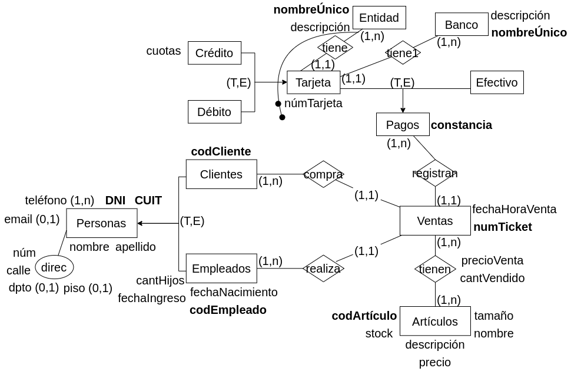

#### 6.  Se debe modelar la información necesaria para un vivero muy importante de la ciudad.

Resulta indispensable conocer la información de los empleados y clientes del vivero. De ambos se registra: D.N.I, C.U.I.T, apellido, nombre, teléfonos de contacto, email si posee y dirección detallada. En particular para los empleados debe registrarse además: fecha de ingreso, fecha de nacimiento, cantidad de hijos y un número único de empleado. De los clientes, se registra además el código único de cliente.

El vivero ofrece diferentes artículos para jardinería: plantas, herramientas, macetas, sustratos entre otros. De todos ellos se registra un número único de artículo, precio, tamaño, nombre, stock y descripción. 

Se deben registrar las ventas realizadas. De cada venta se registra fecha, hora, cliente y el empleado que se encarga de realizar la venta, además se deben registrar el/los artículos vendidos y un número de ticket fiscal. De los artículos vendidos se debe almacenar precio de venta y cantidad vendida.

El cliente puede abonar las compras en efectivo, con débito o crédito. Si abona con débito o crédito, debe quedar registro del número de tarjeta, banco y entidad que la emite (visa, mastercard,..). Del banco y entidad emisora se registra un nombre único y descripción. Si el pago es con crédito se debe registrar además la cantidad de cuotas en que realizó el pago. Tenga en cuenta que la tarjeta se debe poder reutilizar en otros pagos y con otro nro de cuotas. Si abona en efectivo se deberá dejar constancia de esto.

### Modelo ER Conceptual

### Modelo ER Lógico

### Modelo Físico Relacional

- Persona = (<u>DNI</u>, CUIT, nombre, apellido, direccion)

- Telefono = (<u>telefono</u>)

- Email = (<u>email</u>)

- Cliente = (<u>codCliente</u>, DNI(fk))

- Empleado = (<u>codEmpleado</u>, DNI(fk), fechaIngreso, fechaNacimiento, cantHijos)

- Venta = (<u>numTicket</u>, fechaHoraVenta, codCliente(fk), codEmpleado(fk))

- Articulo = (<u>codArticulo</u>, tamanio, stock, nombre, descripcion, precio)

- tiene_tel  = (<u>DNI(fk), telefono</u>)

- tiene_email = (<u>DNI(fk)</u>, email)

- tiene = (<u>numTicket(fk), codArticulo(fk)</u>, precioVenta, cantVendido)

- Efectivo = (<u>numTicket(fk), constancia</u>)

- Tarjeta = (<u>nombreEntidad(fk), numTarjeta</u>)

- Debito = (<u>nombreEntidad, numTarjeta</u>)

- Credito = (<u>nombreEntidad, numTarjeta</u>, cuotas)

- Entidad = (<u>nombreEntidad</u>, descripcion)

- Banco = (<u>nombreBanco</u>, descripcion)

- pago_tarjeta = (<u>numTicket(fk)</u>, (numTarjeta, nombreEntidad)(fk))
