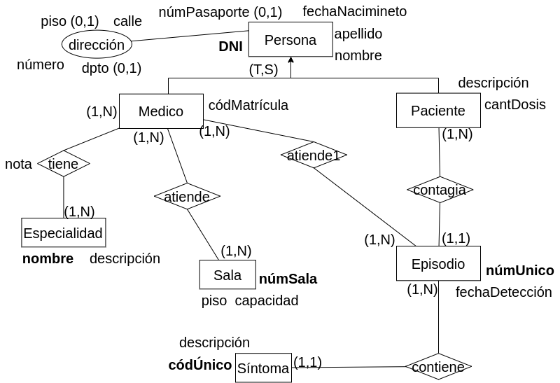
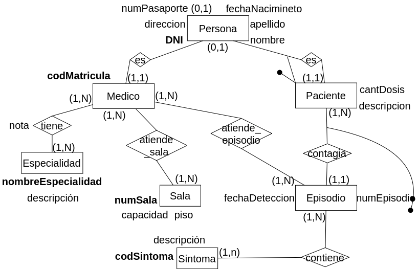

#### 7. Se desea modelar la información necesaria para el tratamiento de pacientes con COVID-19. 

Es necesario representar tanto a los pacientes que han contraído el virus como a los médicos que atienden los casos. Tanto para los médicos como para los pacientes es necesario almacenar: D.N.I, número de pasaporte (si poseen), dirección detallada, nombre,
apellido y fecha de nacimiento. 

Para los pacientes se debe almacenar además, una descripción de enfermedades preexistentes e información referente al episodio de contagio y además cantidad de dosis de la vacuna anti covid. Tenga en cuenta que hay pacientes que pueden contagiarse más de una vez, por lo tanto tendrán más de un episodio. De cada episodio, se registra: número único de episodio, fecha de detección, síntomas y médicos que llevaron a cabo la atención. Los síntomas pueden variar entre los diferentes episodios sabiendo que cada síntoma tiene un código único y una descripción asociada. 

Para los médicos es necesario almacenar además, el código de matrícula, especialidades y sala en la que atiende. Un médico puede rotar de salas y es necesario modelar el historial de rotaciones de cada médico. De la sala se conoce, número de sala (único), piso y capacidad. De las especialidades se almacena un nombre único y descripción. Es necesario que se almacene la nota promedio obtenida por el médico en cada especialidad. 

Tenga en cuenta que un médico también puede contagiarse COVID-19 y su modelo debe permitir representar esto.

Nota: Podría pedirse médico que tiene máximo de atenciones por covid, médico que no atendió más de 10 pacientes, paciente con más contagios, entre otros.

### Modelo ER Conceptual

### Modelo ER Lógico

### Modelo Físico Relacional

- Persona = (<u>DNI</u>, nombre, apellido, fechaNacimientom, direccion, numPasaporte?)

- Medico = (<u>codMatricula</u>, DNI(fk))

- Paciente = (<u>DNI</u>, cantDosis, descripcion)

- Especialidad = (<u>nombreEspecialidad</u>)

- Sala = (<u>numSala</u>, capacidad, piso)

- Episodio = (<u>DNI(fk), numEpisodio</u>, fechaDeteccion)

- Sintoma = (<u>codSintoma</u>, capacidad, piso)

- tiene = (<u>codMatricula(fk), nombreEspecialidad(fk)</u>, nota)

- atiende_sala = (<u>codMatricula(fk), numSala(fk)</u>)

- atiende_episodio = (<u>codMatricula(fk), (DNI, numEpisodio)(fk)</u>)

- contiene = (<u>codSintoma(fk), (DNI, numEpisodio)(fk)</u>)

