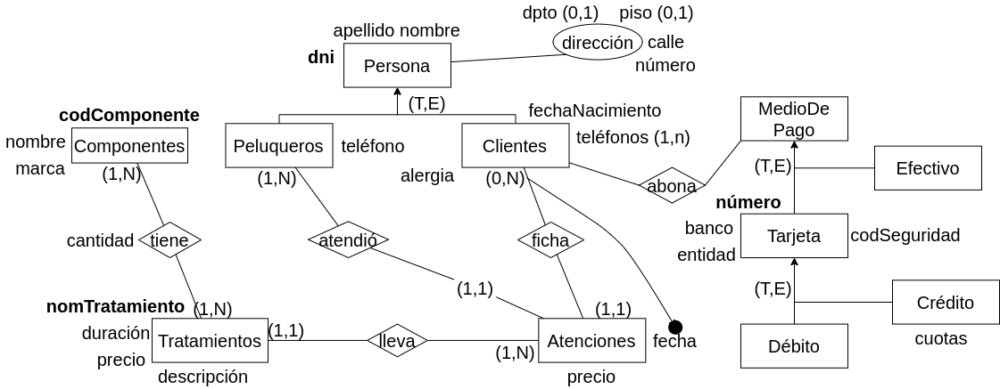
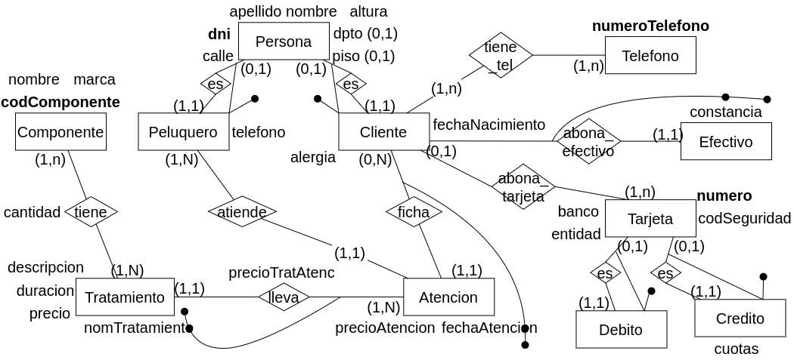

**11.** Se trata de modelar la información de clientes de una peluquería. De cada cliente debe modelarse la información personal: nombre, apellido, fecha de nacimiento, DNI, dirección y teléfonos, además de una descripción si es alérgico a algún componente químico. De cada cliente se tiene una ficha, la misma permite determinar las atenciones que se le realizaron al cliente. De cada atención se debe registrar fecha de atención, que peluquero lo atendió, si se le realizó tratamiento detalle del o los mismos. Se deberá indicar para cada tratamiento aplicado que componentes se utilizaron (en caso de ser necesario) y cantidad de cada componente.

Existen diferentes tratamientos. Los tratamientos se identifican por su nombre, y además se registra una descripción, precio, duración y los componentes necesarios para el mismo (algunos tratamientos pueden no requerir componentes), indicando cantidad sugerida por cada componente. De los componentes se registra código único de componente, nombre y marca que lo fabrica.

De cada peluquero se registran: DNI, apellido, nombre, domicilio detallado, teléfono de contacto.

Tenga en cuenta que el valor de los tratamientos varía con el transcurso del tiempo, se debe poder determinar cuánto pagó un cliente “x”, por el tratamiento “y” en una fecha determinada.

El cliente puede abonar la atención en efectivo, con débito o crédito, debiéndose registrar el modo de pago. Si abona con débito o crédito, debe quedar registro del número de tarjeta (número único), código de seguridad, banco y entidad que la emite (visa, mastercard,..). Si el pago es con crédito se debe registrar además la cantidad de cuotas en que realizó el pago. Los nombres de entidades emisoras y bancos son únicos.

Nota: tenga en cuenta que la tarjeta se puede usar en N pagos y en diferente cantidad de cuotas en cada caso.

### Modelo ER Conceptual

### Modelo ER Lógico

### Modelo Físico Relacional

<u>x</u>

