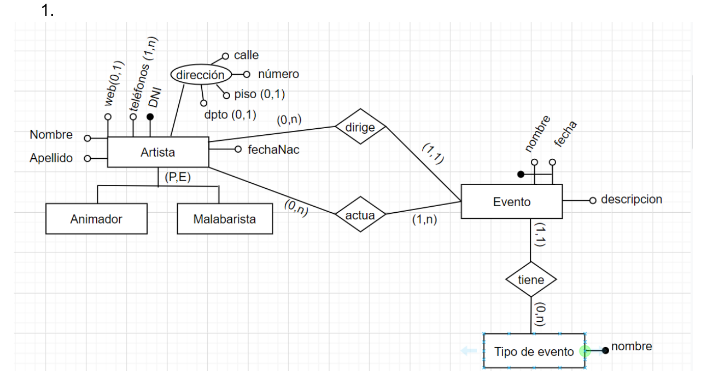
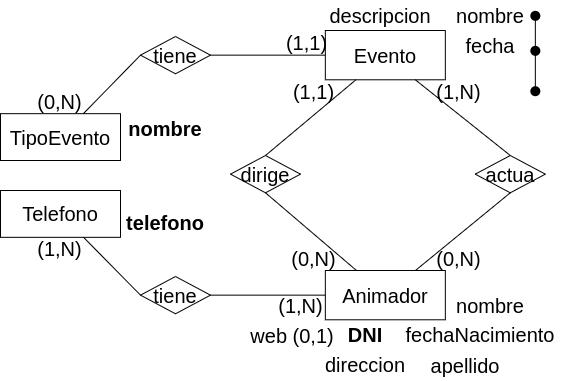

### Modelo ER Conceptual

### Modelo ER Lógico

### Modelo Físico Relacional

Animador = (<u>DNI</u>, nombre, apellido, direccion, fechaNacimiento, web?)

Evento = (<u></u>)

TipoEvento =(<u>x</u>) 

<u>x</u>

