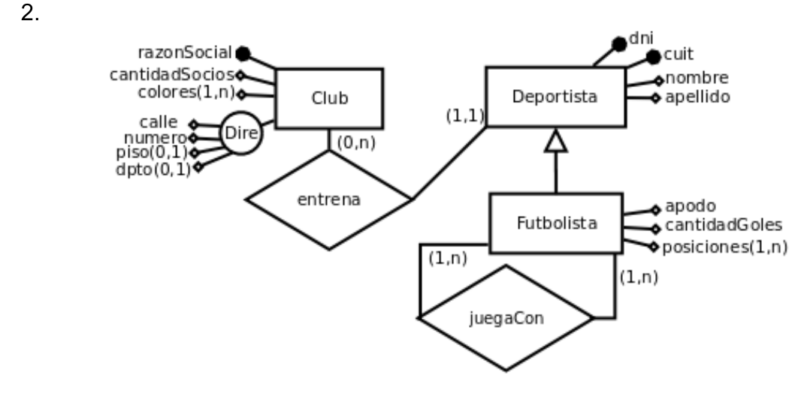
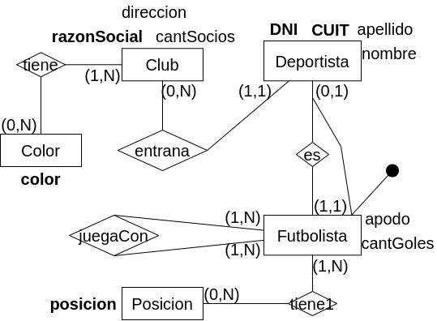

## Modelo ER Conceptual

## Modelo ER Lógico

## Modelo Físico Relacional

- Futbolista = (<u>DNI(fk)</u>, apodo, cantGoles)

- Deportista = (<u>DNI</u>, CUIT, nombre, apellido, razonSocial(fk))

- Club = (<u>razonSocial</u>, direccion, cantSocios)

- Color = (<u>color</u>)

- Posicion = (<u>posicion</u>)

- juegaCon = (<u>DNI(fk), DNICompa(fk)</u>)

- tiene = (<u>razonSocial(fk), color(fk)</u>)

- tiene1 = (<u>DNI(fk), posicion</u>)
