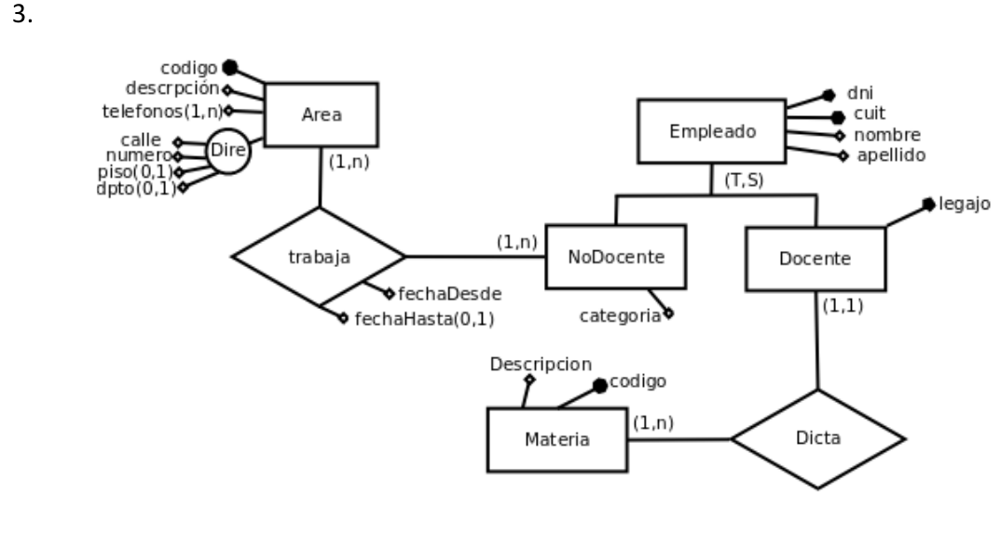
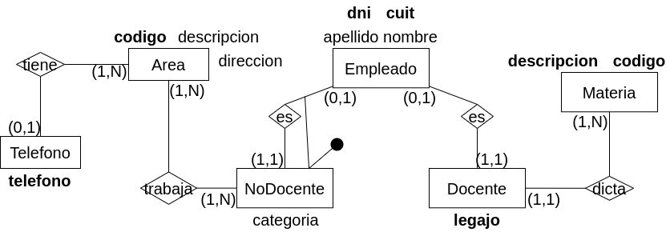

## Modelo ER Conceptual

## Modelo ER Lógico

## Modelo Físico Relacional

- Empleado = (<u>dni</u>, cuit, nombre, apellido)

- NoDocente = (<u>dni(fk)</u>, categoria)

- Docente = (<u>legajo</u>, dni(fk), codigo(fk))

- Materia = (<u>codigo</u>, descripcion)

- Area = (<u>codigo</u>, descripcion, direccion)

- Telefono = (<u>telefono</u>)

- trabaja = (<u>codigo(fk), dni(fk)</u>)

- tiene = (<u>telefono(fk)</u>, codigo(fk))
