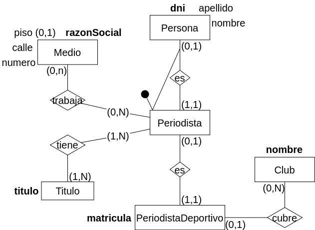
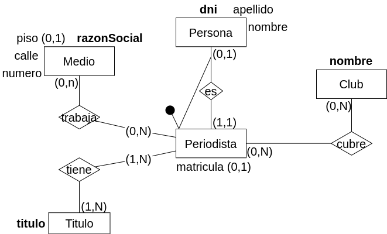

## Modelo ER Conceptual

	<h2 align="center" >Version 1</h2>

## Modelo ER Lógico

## Modelo Físico Relacional

	<h2 align="center" >Version 2</h2>

## Modelo ER Lógico

## Modelo Físico Relacional

<u>x</u>

