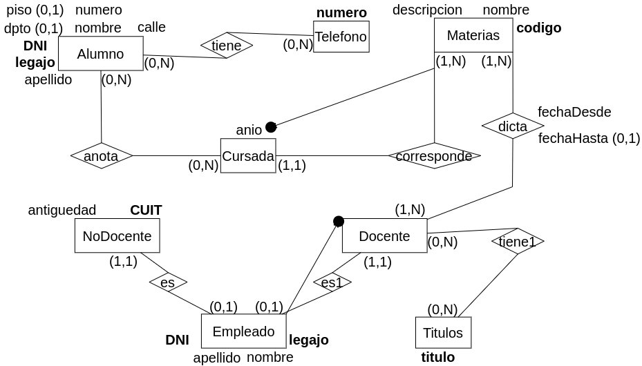

<h2 align="center">Modelo Físico Relacional</h2>

### Introducción
El modelo relacional representa a una BD como una colección de archivos denominados tablas, las cuales se conforman por registros.

Cada tabla se denomina **relación**, y está integrada por filas horizontales y columnas verticales. Cada fila representa un registro del archivo y se denomina **tupla**, mientras que cada columna representa un atributo del registro

### Conversión de Entidades
<u>**Cada entidad se transforma en una tabla:**</u>	

Alumno = (<u>dni</u>, nombre, calle, nro, piso?, dpto?)

- El identificador se subraya (clave primaria).
- Los atributos opcionales llevan signo de pregunta.
- Si tiene la clave primario de otra entidad se le agrega: (fk).

### Conversión de Relaciones.
<u>**Una relación puede o no ser una tabla:**</u>

- Todo depende de la **cardinalidad** de la relación

**Cardinalidad muchos a muchos:**

La solución propuesta es independiente de la cardinalidad mínima definida (obligatoria u opcional).

- La relación N a N se convierte en tabla, conformada por los atributos que definen la CP de cada una de las entidades que relaciona.

	- Las dos claves primarias se subrayan. Así me aseguro que lo que no se va a repetir es el conjunto de las dos claves
	- Analizar también si alguno de los atributos de la relación puede formar parte de la clave primaria.

**Cardinalidad uno a muchos:**

Hay dos alternativas posibles: puede ocurrir que la relación se transforme o no en una tabla. La decisión deberá ser tomada en función a la cardinalidad mínima definida y de las decisiones de diseño que tome el administrador de la BD.

- No se convierte en tabla la relación: La entidad con (1,1) toma el identificador de la otra entidad como (fk).
	- Uno a muchos con participación total ( (1,1) R (1,N) ).	
	- Uno a muchos con participación parcial del lado de muchos ( (1,1) R (0,N) ).
		
		

- Se convierte en tabla la relación: Se toma como clave primaria de la tabla el identificador de la entidad (0,1), ya que es este el que no se va a repetir.
	- Uno a muchos con participación parcial del lado de uno ( (0,1) R (1,N) ).
	- Uno a muchos con cobertura parcial de ambos lados ( (0,1) R (0,N) ).
	
**Cardinalidad uno a uno:**

- Uno a uno con participación total de ambos lados ( (1,1) R (1,1) )
	- La relación no se convierte en tabla.
	- Es indistinto pasar el identificador de uno o el otro como (fk).

- Uno a uno con participación parcial del lado de uno ( (0,1) R (1,1) )
	- La relación no se convierte en tabla.
	- Se pasa el identificador de la entidad de (0,1), como (fk) a la entidad de (1,1).

- Uno a uno con participación parcial de ambos lados ( (0,1) R (0,1) ). Nada asegura que una entidad esté relacionada con otra.
	- Se convierte la relación en tabla.
	- Se pasan los dos identificadores a la relación y se elige cualquiera como clave primaria.

### Resolver Atributos Compuestos

- Considerar sólo los atributos individuales.

- Considerar todo en un sólo atributo.

### Resolver Atributos Polivalentes

- Se debe agregar una entidad y una interrelación.

#### Parte Conceptual:

#### Parte Lógica:

#### Parte Física:
- Alumno = (<u>DNI</u>, legajo, nombre, apellido, calle, numero, piso?, dpto?)
- Telefono = (<u>numero</u>)
- Materia = (<u>codigo</u>, nombre, descripcion)
- Cursada = (<u>anio, codigo</u>)
- Empleado = (<u>DNI</u>, legajo, nombre, apellido)
- Docente = (<u>DNI</u>)
- NoDocente = (<u>CUIT</u>, DNI(fk), antiguedad)
- Titulo = (<u>titulo</u>)
- tiene = (<u>DNI, numero</u>)
- anota = (<u>DNI, codigo, anio</u>)
- tiene1 = (<u>DNI, titulo</u>)
- dicta = (<u>DNI, codigo, fechaDesde</u>, fechaHasta?)
	- un docente puede dictar más de una vez la misma materia, por eso necesito la fecha desde también como clave primaria
