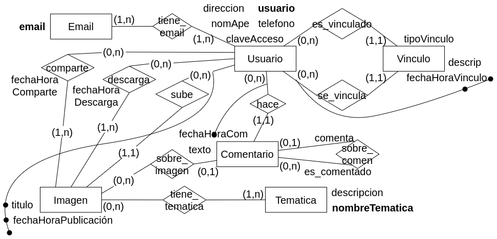

- [Modelo lógico](#modelo-lógico)
	- [Decisiones sobre el Modelo Lógico](#decisiones-sobre-el-modelo-lógico)
		- [Introducción](#introducción)
		- [Resolver Jerarquías](#resolver-jerarquías)
		- [Resolver Atributos Compuestos](#resolver-atributos-compuestos)
		- [Resolver Atributos Polivalentes](#resolver-atributos-polivalentes)
		- [Ejercicio Integrador:](#ejercicio-integrador)
			- [Parte Conceptual:](#parte-conceptual)
			- [Parte Lógica:](#parte-lógica)
- [Modelo Físico](#modelo-físico)
	- [Modelo Físico Relacional](#modelo-físico-relacional)
		- [Introducción](#introducción-1)
		- [Conversión de Entidades](#conversión-de-entidades)
		- [Conversión de Relaciones.](#conversión-de-relaciones)
		- [Resolver Atributos Compuestos](#resolver-atributos-compuestos-1)
		- [Resolver Atributos Polivalentes](#resolver-atributos-polivalentes-1)
		- [Ejercicio Integrador:](#ejercicio-integrador-1)
			- [Parte Conceptual:](#parte-conceptual-1)
			- [Parte Lógica:](#parte-lógica-1)
			- [Parte Física:](#parte-física)
- [Resolución práctica 2](#resolución-práctica-2)
	- [Parte 1: Modelado Conceptual, Lógico y Físico.](#parte-1-modelado-conceptual-lógico-y-físico)
		- [Se debe modelar la información necesaria para una Inmobiliaria de la ciudad de La Plata.](#se-debe-modelar-la-información-necesaria-para-una-inmobiliaria-de-la-ciudad-de-la-plata)
			- [Modelo ER Conceptual.](#modelo-er-conceptual)
			- [Modelo ER Lógico.](#modelo-er-lógico)
			- [Modelo Físico Relacional.](#modelo-físico-relacional-1)
		- [2 Se desea modelar el manejo de la información referente a una casa de comidas.](#2-se-desea-modelar-el-manejo-de-la-información-referente-a-una-casa-de-comidas)
			- [Modelo ER Conceptual](#modelo-er-conceptual-1)
			- [Modelo ER Lógico](#modelo-er-lógico-1)
			- [Modelo Físico Relacional](#modelo-físico-relacional-2)
		- [3. Se desea modelar la información necesaria para el tratamiento de pacientes con COVID-19.](#3-se-desea-modelar-la-información-necesaria-para-el-tratamiento-de-pacientes-con-covid-19)
			- [Modelo ER Conceptual](#modelo-er-conceptual-2)
			- [Modelo ER Lógico](#modelo-er-lógico-2)
			- [Modelo Físico Relacional](#modelo-físico-relacional-3)
		- [4. Se desea modelar la información necesaria para una cadena de tiendas de indumentaria.](#4-se-desea-modelar-la-información-necesaria-para-una-cadena-de-tiendas-de-indumentaria)
	- [VER CONCEPTUAL PARTE PRODUCTO-TIENDA](#ver-conceptual-parte-producto-tienda)
			- [Modelo ER Conceptual.](#modelo-er-conceptual-3)
			- [Modelo ER Lógico.](#modelo-er-lógico-3)
			- [Modelo Físico Relacional.](#modelo-físico-relacional-4)
		- [5. Se desea modelar la información necesaria para una red social.](#5-se-desea-modelar-la-información-necesaria-para-una-red-social)
			- [Modelo ER Conceptual.](#modelo-er-conceptual-4)
			- [Modelo ER Lógico.](#modelo-er-lógico-4)
			- [Modelo Físico Relacional.](#modelo-físico-relacional-5)
		- [6.  Se debe modelar la información necesaria para un vivero muy importante de la ciudad.](#6--se-debe-modelar-la-información-necesaria-para-un-vivero-muy-importante-de-la-ciudad)
			- [Modelo ER Conceptual.](#modelo-er-conceptual-5)
			- [Modelo ER Lógico.](#modelo-er-lógico-5)
			- [Modelo Físico Relacional.](#modelo-físico-relacional-6)
		- [7. Se desea modelar la información necesaria para una empresa dedicada a la realización de eventos gastronómicos al aire libre.](#7-se-desea-modelar-la-información-necesaria-para-una-empresa-dedicada-a-la-realización-de-eventos-gastronómicos-al-aire-libre)
			- [Modelo ER Conceptual.](#modelo-er-conceptual-6)
			- [Modelo ER Lógico.](#modelo-er-lógico-6)
			- [Modelo Físico Relacional.](#modelo-físico-relacional-7)
		- [8. Se desea modelar una base de datos para el manejo de una unidad del servicio penitenciario (cárcel en lenguaje coloquial).](#8-se-desea-modelar-una-base-de-datos-para-el-manejo-de-una-unidad-del-servicio-penitenciario-cárcel-en-lenguaje-coloquial)
			- [Modelo ER Conceptual.](#modelo-er-conceptual-7)
			- [Modelo ER Lógico.](#modelo-er-lógico-7)
			- [Modelo Físico Relacional.](#modelo-físico-relacional-8)
		- [9.  Se debe modelar la información correspondiente para la gestión de personal y proyectos de una empresa de software con sede en la ciudad de La Plata.](#9--se-debe-modelar-la-información-correspondiente-para-la-gestión-de-personal-y-proyectos-de-una-empresa-de-software-con-sede-en-la-ciudad-de-la-plata)
			- [Modelo ER Conceptual.](#modelo-er-conceptual-8)
			- [Modelo ER Lógico.](#modelo-er-lógico-8)
			- [Modelo Físico Relacional.](#modelo-físico-relacional-9)
		- [10. Se debe modelar la información necesaria para una herramienta que permita realizar el seguimiento de tareas que desempeña determinada empresa en sus proyectos.](#10-se-debe-modelar-la-información-necesaria-para-una-herramienta-que-permita-realizar-el-seguimiento-de-tareas-que-desempeña-determinada-empresa-en-sus-proyectos)
			- [Modelo ER Conceptual.](#modelo-er-conceptual-9)
			- [Modelo ER Lógico.](#modelo-er-lógico-9)
			- [Modelo Físico Relacional.](#modelo-físico-relacional-10)
		- [11. Se trata de modelar la información de clientes de una peluquería.](#11-se-trata-de-modelar-la-información-de-clientes-de-una-peluquería)
			- [Modelo ER Conceptual.](#modelo-er-conceptual-10)
			- [Modelo ER Lógico.](#modelo-er-lógico-10)
			- [Modelo Físico Relacional.](#modelo-físico-relacional-11)
		- [12.  Se debe modelar la información necesaria para la gestión de un colegio de la ciudad de La Plata.](#12--se-debe-modelar-la-información-necesaria-para-la-gestión-de-un-colegio-de-la-ciudad-de-la-plata)
			- [Modelo ER Conceptual.](#modelo-er-conceptual-11)
			- [Modelo ER Lógico.](#modelo-er-lógico-11)
			- [Modelo Físico Relacional.](#modelo-físico-relacional-12)
		- [13. Se debe modelar la información necesaria para una billetera virtual.](#13-se-debe-modelar-la-información-necesaria-para-una-billetera-virtual)
			- [Modelo ER Conceptual.](#modelo-er-conceptual-12)
			- [Modelo ER Lógico.](#modelo-er-lógico-12)
			- [Modelo Físico Relacional.](#modelo-físico-relacional-13)

# Modelo lógico
## Decisiones sobre el Modelo Lógico
### Introducción
El propósito de la generación de un modelo ER Lógico es convertir el esquema conceptual a un modelo más cercano a la representación entendible por el SGBD (Motor de Bases de Datos).

### Resolver Jerarquías
El modelo relacional no soporta el concepto de herencia; por consiguiente, las jerarquías no pueden ser representadas.

- **Total Exclusiva (T,E):** Hay tres posibilidades.

- **Total Superpuesta (T,S):** Dos posibilidades. 
	- Dejar todo o dejar solo al padre.
	- No se puede eliminar el padre.
	
- **Parcial Exclusiva (P,E):** Dos posibilidades. 
	- Dejar todo o dejar solo al padre.
	- No se puede eliminar el padre
	
- **Parcial Superpuesta (P,S):** Dos posibilidades. 
	- Dejar todo o dejar solo al padre.
	- No se puede eliminar el padre

**Opciones para resolver Jerarquías**

- _Dejar todas las entidades:_ 
	- Si las entidades hijas no tienen identificador propio, debo bajarlo desde el padre como identificador externo. Caso contrario es opcional.
	- La cardinalidad del padre siempre es (0,1).
	- La cardinalidad de los hijos siempre es (1,1).
	
- _Dejar solo al padre:_
	- Todos los atributos de los hijos pasan al padre.
	- Deben pasar como no obligatorios (0,1). Idem las relaciones en los hijos pasan como relaciones opcionales (mínima 0).
	- Si en el hijo era un atributo identificador, debe dejar de serlo. (Nunca un identificador puede ser opcional).
	
- _Dejar solo a los hijos:_
	- Se deben bajar los atributos del padre a cada uno de sus hijos.

### Resolver Atributos Compuestos

1. Generar un **único atributo** que se convierta en la concatenación de todos los atributos simples que contiene el atributo compuesto. Esta solución es simple y sencilla de implantar, pero al unir todos los atributos simples que forman el compuesto, se pierde la identidad de cada atributo simple.

2. Definir todos los atributos **como simples**. Permite al usuario definir cada uno de los datos en forma independiente, siendo la solución más indicada.

3. Generar una **nueva entidad**, conformada por cada uno de los atributos simples que contiene. Debe estar relacionada con la entidad a la cual pertenecía el atributo compuesto. Capta mejor la esencia del atributo, pero es una opción más compleja.

### Resolver Atributos Polivalentes
Ningún SGBD relacional permite que un atributo contenga valores múltiples determinados dinámicamente. Es decir, se puede tener un atributo con múltiples valores, pero la cantidad máxima debe ser previamente determinada.

- Se quita el atributo polivalente generando una entidad y una interrelación.

- Si todos los atributos de entidades y relaciones son atributos simples se dice que el modelo está en **Primera Forma Normal (1FN)**.
	- El modelo no tiene atributos polivalentes.
	

### Ejercicio Integrador:

Se desea modelar la información referente a los alumnos de la facultad de informática. De los alumnos se conoce su DNI, Legajo, nombre y apellido dirección detallada y teléfono/s.

Además se conoce información sobre las materias que se dictan en al facultad. De las materias se conoce código único de materia, nombre y descrpción. Es importante representar las cursadas de cada materia. De cada cursada se sabe el año en que se dicta y a que materia corresponde. Una materia se cursa una única vez por año. Un alumno se puede inscribir a una o varias materias.

Además es necesario modelar a los empleados de la facultad. De los empleados se conoce DNI, nombre, apellido y legajo. De los empleados docentes además se conoce el título (puede no tener título o tener más de uno) y las materias que dicta. El docente puede rotar de materia, por lo que es necesario representar el historial de materias por el que pasó. Por otro lado, de los empleados no docentes es necesario representar CUIT y antiguedad.

#### Parte Conceptual:

#### Parte Lógica:

# Modelo Físico
## Modelo Físico Relacional

### Introducción
El modelo relacional representa a una BD como una colección de archivos denominados tablas, las cuales se conforman por registros.

Cada tabla se denomina **relación**, y está integrada por filas horizontales y columnas verticales. Cada fila representa un registro del archivo y se denomina **tupla**, mientras que cada columna representa un atributo del registro

### Conversión de Entidades
<u>**Cada entidad se transforma en una tabla:**</u>	

Alumno = (<u>dni</u>, nombre, calle, nro, piso?, dpto?)

- El identificador se subraya (clave primaria).
- Los atributos opcionales llevan signo de pregunta.
- Si tiene la clave primario de otra entidad se le agrega: (fk).

### Conversión de Relaciones.
<u>**Una relación puede o no ser una tabla:**</u>

- Todo depende de la **cardinalidad** de la relación

**Cardinalidad muchos a muchos.** La solución propuesta es independiente de la cardinalidad mínima definida (obligatoria u opcional).

- La relación N a N se convierte en tabla, conformada por los atributos que definen la CP de cada una de las entidades que relaciona.

	- Las dos claves primarias se subrayan. Así me aseguro que lo que no se va a repetir es el conjunto de las dos claves
	- Analizar también si alguno de los atributos de la relación puede formar parte de la clave primaria.

**Cardinalidad uno a muchos.** Hay dos alternativas posibles: puede ocurrir que la relación se transforme o no en una tabla. La decisión deberá ser tomada en función a la cardinalidad mínima definida y de las decisiones de diseño que tome el administrador de la BD.

- No se convierte en tabla la relación: La entidad con (1,1) toma el identificador de la otra entidad como (fk).
	- Uno a muchos con participación total ( (1,1) R (1,N) ).	
	- Uno a muchos con participación parcial del lado de muchos ( (1,1) R (0,N) ).
		
		

- Se convierte en tabla la relación: Se toma como clave primaria de la tabla el identificador de la entidad (0,1), ya que es este el que no se va a repetir.
	- Uno a muchos con participación parcial del lado de uno ( (0,1) R (1,N) ).
	- Uno a muchos con cobertura parcial de ambos lados ( (0,1) R (0,N) ).
	
**Cardinalidad uno a uno.**

- Uno a uno con participación total de ambos lados ( (1,1) R (1,1) )
	- La relación no se convierte en tabla.
	- Es indistinto pasar el identificador de uno o el otro como (fk).

- Uno a uno con participación parcial del lado de uno ( (0,1) R (1,1) )
	- La relación no se convierte en tabla.
	- Se pasa el identificador de la entidad de (0,1), como (fk) a la entidad de (1,1).

- Uno a uno con participación parcial de ambos lados ( (0,1) R (0,1) ). Nada asegura que una entidad esté relacionada con otra.
	- Se convierte la relación en tabla.
	- Se pasan los dos identificadores a la relación y se elige cualquiera como clave primaria.

### Resolver Atributos Compuestos

- Considerar sólo los atributos individuales.

- Considerar todo en un sólo atributo.

### Resolver Atributos Polivalentes

- Se debe agregar una entidad y una interrelación.

### Ejercicio Integrador:
#### Parte Conceptual:

#### Parte Lógica:

#### Parte Física:
- Alumno = (<u>DNI</u>, legajo, nombre, apellido, calle, numero, piso?, dpto?)
- Telefono = (<u>numero</u>)
- Materia = (<u>codigo</u>, nombre, descripcion)
- Cursada = (<u>anio, codigo</u>)
- Empleado = (<u>DNI</u>, legajo, nombre, apellido)
- Docente = (<u>DNI</u>)
- NoDocente = (<u>CUIT</u>, DNI(fk), antiguedad)
- Titulo = (<u>titulo</u>)
- tiene = (<u>DNI, numero</u>)
- anota = (<u>DNI, codigo, anio</u>)
- tiene1 = (<u>DNI, titulo</u>)
- dicta = (<u>DNI, codigo, fechaDesde</u>, fechaHasta?)
	- un docente puede dictar más de una vez la misma materia, por eso necesito la fecha desde también como clave primaria

# Resolución práctica 2
## Parte 1: Modelado Conceptual, Lógico y Físico.
### Se debe modelar la información necesaria para una Inmobiliaria de la ciudad de La Plata.

Es necesario modelar la información de clientes y empleados de la inmobiliaria. De ambos seconoce D.N.I, nombre, apellido y dirección detallada. Además de los empleados se conoce el número de legajo, el cual no se repite entre diferentes empleados y el área donde trabaja cada uno. Los empleados pueden ir rotando de área a lo largo del tiempo y es necesario modelar por las distintas áreas que pasó un empleado. De las áreas se conoce código único de área, descripción, teléfonos y ubicación. De cada cliente, además, se debe almacenar sexo, nacionalidad, número de pasaporte (si tuviera) y los inmuebles de los que es dueño. Un cliente no puede trabajar en la inmobiliaria.

La inmobiliaria maneja diferentes inmuebles de los cuales se conoce dirección detallada, código único de inmueble, cantidad de ambientes, si posee balcón, si posee lavadero, cantidad de baños, si se alquila, se vende o ambas cosas, precio de venta y precio de alquiler, tipo de inmueble (casa, duplex, depto,...).

Debe quedar registrado todo alquiler y venta que realiza la inmobiliaria detallando, para los alquileres inmueble, cliente, fechas de inicio y fin de alquiler, empleado que alquiló y precio. De las ventas se registran fecha y hora de venta, cliente, empleado que vendió la propiedad, precio de venta y comisión de venta.

Nota: tenga en cuenta que podría pedirse promedio de ventas de un semestre del año, vendedor más exitoso del año, tipo de inmueble más alquilado o más vendido entre otros

#### Modelo ER Conceptual.

#### Modelo ER Lógico.

#### Modelo Físico Relacional.

- Persona = (<u>DNI</u>, nombre, apellido, calle, numero, dpto?, piso?)

- Empleado = (<u>nroLegajo</u>, DNI(fk))

- Cliente = (<u>DNI</u>, nacionalidad, sexo, numeroPasaporte?)

- Area = (<u>codUnico</u>, descripcion, ubicacion)

- Telefono = (<u>numero</u>)

- Venta = (<u>fechaVenta, codUnico(fk)</u>, numeroLegajo(fk), DNI(fk), comision, precio, hora)

- Alquiler = (<u>fechaInicio, codUnico(fk)</u>, numeroLegajo(fk), DNI(fk), fechaFin, precio)

- Tipo = (<u>tipoInmueble</u>)

- Inmueble = (<u>codUnico</u>, tipoInmueble(fk), cantAmbientes, lavadero, cantBanios, balcon, numero, calle, piso?, dpto?)

- tiene2 = (<u>numero(fk), codUnico(fk)</u>)

- trabaja = (<u>nroLegajo(fk), codUnico(fk), fechaInicio</u>, fechaFin?)

### 2 Se desea modelar el manejo de la información referente a una casa de comidas. 
De los clientes se conoce D.N.I, apellidos, teléfonos, dirección detallada, mail y CUIL. La casa vende diferentes platos de los que se conoce código único, precio actual y descripción.

Cuando un cliente llama, se le toma el pedido, el cual puede estar formado por uno o varios platos. Debe quedar registro de la fecha y hora que se realizó el llamado, la fecha y hora de entrega del pedido, el precio total y los precios que fue vendido cada producto. Los repartos se realizan por zonas, conociéndose de cada zona el número único de zona y el costo de envío hasta esa zona. Es necesario poder obtener el costo de envío de un pedido dado.

Por otro lado, debemos modelar la reposición de materia prima con la que se elaboran los platos. Cada plato está formado por varios productos de los que se conoce código, descripción, precio actual, stock y cantidad mínima. Se realizan compras de productos a proveedores de los cuales se conoce nro único de proveedor, D.N.I, nombre, apellido y razón social (único). Por cada compra debemos poder obtener los productos involucrados, el proveedor, la fecha, la hora y el precio al que se compró cada producto.

**Nota:** tenga en cuenta que se podría pedir: obtener los productos que conforman cada plato como así también aquellos pedidos que fueron entregados, los pedidos que fueron rechazados, pedidos mayores a $10000 y los pedidos que se encuentran pendientes, entre otras estadísticas y consultas.

#### Modelo ER Conceptual

#### Modelo ER Lógico

#### Modelo Físico Relacional

- Persona = (<u>DNI</u>, nombre, apellido)

- Cliente = (<u>CUIL</u>, direccion, mail, DNI(fk))

- Provedor = (<u>razonSocial</u>, DNI(fk))

- Telefono = (<u>numTel</u>)

- Pedido = (<u>CUIL(fk), fechaHoraPedido</u>, precioTotal, codZona(fk))

- Zona = (<u>codZona</u>, costoEnvio)

- Plato = (<u>codPlato</u>, precioPlatoActual, descripcion)

- Producto = (<u>codPlato(fk), codigo</u>, stock, descripcion, precioProducto, cantMinima, (razonSocial, fechaHoraCompra)(fk))

- Compra = (<u>razonSocial(fk), fechaHoraCompra</u>, )

- formado = (<u>(CUIL, fechaHoraPedido)(fk), codPlato(fk)</u>, precioPlato)

- tiene_tel = (<u>CUIL(fk), numTel(fk)</u>)

### 3. Se desea modelar la información necesaria para el tratamiento de pacientes con COVID-19. 
Es necesario representar tanto a los pacientes que han contraído el virus como a los médicos que atienden los casos. Tanto para los médicos como para los pacientes es necesario almacenar: D.N.I, número de pasaporte (si poseen), dirección detallada, nombre, apellido y fecha de nacimiento.

Para los pacientes se debe almacenar además, una descripción de enfermedades preexistentes e información referente al episodio de contagio y además cantidad de dosis de la vacuna anti covid. Tenga en cuenta que hay pacientes que pueden contagiarse más de una vez, por lo tanto tendrán más de un episodio. De cada episodio, se registra: número único de episodio, fecha de detección, síntomas y médicos que llevaron a cabo la atención. Los síntomas pueden variar entre los diferentes episodios sabiendo que cada síntoma tiene un código único y una descripción asociada.

Para los médicos es necesario almacenar además, el código de matrícula, especialidades y sala en la que atiende. Un médico puede rotar de salas y es necesario modelar el historial de
rotaciones de cada médico. De la sala se conoce, número de sala (único), piso y capacidad. De las especialidades se almacena un nombre único y descripción. Es necesario que se almacene la nota promedio obtenida por el médico en cada especialidad.

Tenga en cuenta que un médico también puede contagiarse COVID-19 y su modelo debe permitir representar esto.

**Nota:** Podría pedirse médico que tiene máximo de atenciones por covid, médico que no atendió más de 10 pacientes, paciente con más contagios, entre otros.

#### Modelo ER Conceptual

#### Modelo ER Lógico

#### Modelo Físico Relacional

- Persona = (<u>DNI</u>, nombre, apellido, fechaNacimientom, direccion, numPasaporte?)

- Medico = (<u>codMatricula</u>, DNI(fk))

- Paciente = (<u>DNI</u>, cantDosis, descripcion)

- Especialidad = (<u>nombreEspecialidad</u>)

- Sala = (<u>numSala</u>, capacidad, piso)

- Episodio = (<u>DNI(fk), numEpisodio</u>, fechaDeteccion)

- Sintoma = (<u>codSintoma</u>, capacidad, piso)

- tiene = (<u>codMatricula(fk), nombreEspecialidad(fk)</u>, nota)

- atiende_sala = (<u>codMatricula(fk), numSala(fk)</u>)

- atiende_episodio = (<u>codMatricula(fk), (DNI, numEpisodio)(fk)</u>)

- contiene = (<u>codSintoma(fk), (DNI, numEpisodio)(fk)</u>)

### 4. Se desea modelar la información necesaria para una cadena de tiendas de indumentaria.
De cada tienda se desea almacenar: la razón social, su dirección completa, un teléfono de contacto, instagram y facebook de la misma (si posee). Las tiendas están conformadas por un grupo de empleados y un supervisor a cargo de la misma. De los empleados se registran: DNI, CUIL, nombre, apellido, fecha de nacimiento, dirección, uno o varios teléfonos de contacto, fecha de ingreso, cantidad de hijos y estado civil.

Las tiendas están divididas en sectores de trabajo: personal, proveedores, ventas, entre otros. De cada sector se registra nombre, descripción y un código único relativo a la tienda, el mismo código de sector puede estar en varias tiendas. Cada empleado está asignado a un sector determinado pero con el transcurso del tiempo va cambiando de sector; se debe poder determinar los sectores por los que pasó un empleado en orden cronológico. Cada empleado trabaja en una y solo una tienda. El supervisor sólo podrá estar a cargo de una tienda.

De los productos que se comercializan en las tiendas se debe registrar: tipo de producto, marca, modelo, talle, descripción, color, precio de venta y el stock del mismo en la tienda y un código único de producto. Por último, se deben registrar las ventas realizadas, indicando fecha, número de ticket fiscal, empleado que efectúa la venta, el/los productos involucrados y el total de la misma.

**Notas:**
- El supervisor es un empleado de la tienda que se desempeña como tal.
- Tenga en cuenta que el stock de un producto y el precio de venta del producto podrían variar en las diferentes tiendas.
- Se debe poder consultar la información mediante diferentes alternativas: marca y/o modelo más vendidos, tipo de productos más vendidos, entre otras.
## VER CONCEPTUAL PARTE PRODUCTO-TIENDA
#### Modelo ER Conceptual.

#### Modelo ER Lógico.

#### Modelo Físico Relacional.
- Empleado = (<u>DNI</u>, CUIL, nombre, apellido, cantHijos, direccion, esadoCivil, fechaNacimiento, fechaIngreso, razonSocial (fk))

- supervisa = (<u>DNISupervisor(fk)</u>, DNI(fk))

- Sector = (<u> razonSocial(fk), codRelativo</u>, nombre, descripcion)

- Tienda = (<u>razonSocial</u>, DNI(fk), numero(fk), instagram, facebook, calle, altura, dpto?, piso?)

- Telefono = (<u>numerTel</u>)

- Venta = (<u>DNI(fk), nroTicket</u>, fecha, total)

- Producto = (<u>codProducto</u>, (DNI, nroTicket)(fk), marca(fk), modelo(fk), tipo(fk), razonSocial(fk))

- Tipo = (<u>tipo</u>)

- Modelo = (<u>modelo</u>)

- Marca = (<u>marca</u>)

- asigna = (<u>DNI(fk), (codRelativo, razonSocial)(fk), fechaDesde</u>, fechaHasta?)

- tiene_tel = (<u>numero(fk), DNI(fk)</u>)

### 5. Se desea modelar la información necesaria para una red social. 
La red social permite a los usuarios compartir imágenes de diferentes temáticas y realizar comentarios sobre las mismas. De los usuarios se registran: nombre y apellido, usuario en la red social (que es único), clave de acceso, cuentas de correo electrónico, dirección detallada y un teléfono de contacto. 

En la red social, los usuarios pueden subir imágenes, o bien comentar, descargar o compartir una publicación (imagen) de otros usuarios vinculados.

Cuando dos usuarios se vinculan, se debe almacenar información de este vínculo: fecha y hora, tipo de vínculo y opcionalmente una descripción estandarizada en la red social que indica de donde se conocen (lugar de vínculo). En la misma fecha y hora el mismo usuario no podrá generar dos vínculos.

De las imágenes se debe almacenar: fecha y hora de publicación, temática de la imagen, título, usuario que realiza el posteo y el nombre del archivo correspondiente, además de un conjunto de palabras claves que caracterizan la imagen. Un usuario no puede subir dos imágenes con título idéntico. De las temáticas se registra un nombre único y una descripción asociada.

De las imágenes se debe poder determinar los usuarios que compartieron la imagen o la descargaron, indicando fecha y hora y si la compartió o descargó.

Así mismo, los usuarios pueden realizar comentarios en la red social, se debe almacenar un texto, la fecha y hora de creación del comentario, que imagen comentó o a que comentario respondió. Un comentario podría ser respuesta a otro comentario existente. Un usuario no podrá realizar dos comentarios en la misma fecha y hora.

#### Modelo ER Conceptual.

#### Modelo ER Lógico.

#### Modelo Físico Relacional.
- Usuario = (<u>usuario</u>, direccion, nomApe, telefono, claveAcceso)

- Email = (<u>email</u>)

- Vinculo = (<u>fechaHoraVinculo, usuario(fk)</u>, descripcion, tipoVinculo, usuarioSolicitado(fk))

- Imagen = (<u>titulo, fechaHoraPublicacion, usuario(fk)</u>)

- Comentario = (<u>fechaHoraComentario, usuarioComenta(fk)</u>, fechaHora)

- Tematica = (<u>nombreTematica</u>, descripcion)

- tiene_tematica = (<u>(usuario, titulo, fechaHoraPublicacion)(fk), nombreTematica(fk)</u>)

- tiene_email = (<u>email(fk), usuario(fk)</u>)

- sobre_imagen = (<u>fechaHoraComentario, usuario(fk)</u>, titulo, fechaHoraPublicacion, usuario)

- sobre_comentario = (<u>fechaHoraComentario, usuario(fk)</u>, fechaHoraComentarioResponde, usuarioResponde(fk))

- comparte = (<u>(titulo, fechaHoraPublicacion, usuarioSube)(fk), usuarioComparte(fk)</u>, fechaHoraComparte)

- descarga = (<u>(titulo, fechaHoraPublicacion, usuarioSube)(fk), usuarioBaja(fk)</u>, fechaHoraDescarga)

### 6.  Se debe modelar la información necesaria para un vivero muy importante de la ciudad.
Resulta indispensable conocer la información de los empleados y clientes del vivero. De ambos se registra: D.N.I, C.U.I.T, apellido, nombre, teléfonos de contacto, email si posee y dirección detallada. En particular para los empleados debe registrarse además: fecha de ingreso, fecha de nacimiento, cantidad de hijos y un número único de empleado. De los clientes, se registra además el código único de cliente.

El vivero ofrece diferentes artículos para jardinería: plantas, herramientas, macetas, sustratos entre otros. De todos ellos se registra un número único de artículo, precio, tamaño, nombre,stock y descripción.

Se deben registrar las ventas realizadas. De cada venta se registra fecha, hora, cliente y el empleado que se encarga de realizar la venta, además se deben registrar el/los artículos vendidos y un número de ticket fiscal. De los artículos vendidos se debe almacenar precio de venta y cantidad vendida.

El cliente puede abonar las compras en efectivo, con débito o crédito. Si abona con débito o crédito, debe quedar registro del número de tarjeta, banco y entidad que la emite (visa, mastercard,..). Del banco y entidad emisora se registra un nombre único y descripción. Si el pago es con crédito se debe registrar además la cantidad de cuotas en que realizó el pago. Tenga en cuenta que la tarjeta se debe poder reutilizar en otros pagos y con otro nro de cuotas. Si abona en efectivo se deberá dejar constancia de esto.

#### Modelo ER Conceptual.

#### Modelo ER Lógico.

#### Modelo Físico Relacional.
- Persona = (<u>DNI</u>, CUIT, nombre, apellido, direccion)

- Telefono = (<u>telefono</u>)

- Email = (<u>email</u>)

- Cliente = (<u>codCliente</u>, DNI(fk))

- Empleado = (<u>codEmpleado</u>, DNI(fk), fechaIngreso, fechaNacimiento, cantHijos)

- Venta = (<u>numTicket</u>, fechaHoraVenta, codCliente(fk), codEmpleado(fk))

- Articulo = (<u>codArticulo</u>, tamanio, stock, nombre, descripcion, precio)

- tiene_tel  = (<u>DNI(fk), telefono</u>)

- tiene_email = (<u>DNI(fk)</u>, email)

- tiene = (<u>numTicket(fk), codArticulo(fk)</u>, precioVenta, cantVendido)

- Efectivo = (<u>numTicket(fk), constancia</u>)

- Tarjeta = (<u>nombreEntidad(fk), numTarjeta</u>)

- Debito = (<u>nombreEntidad, numTarjeta</u>)

- Credito = (<u>nombreEntidad, numTarjeta</u>, cuotas)

- Entidad = (<u>nombreEntidad</u>, descripcion)

- Banco = (<u>nombreBanco</u>, descripcion)

- pago_tarjeta = (<u>numTicket(fk)</u>, (numTarjeta, nombreEntidad)(fk))

### 7. Se desea modelar la información necesaria para una empresa dedicada a la realización de eventos gastronómicos al aire libre. 
Para cada evento se alquilan cierta cantidad de lugares donde el inquilino podrá vender productos comestibles o bien utilizarlo para difundir su actividad, además se brindan servicios tales como electricidad, agua corriente y demás, si el inquilino lo requiere. De los lugares se registra: número, descripción, metros cuadrados (m2), ubicación, distancia a la puerta de acceso al predio y precio por día. De los servicios en cambio se registra: nombre único, descripción y precio del servicio. 

De cada evento se registra: nombre del evento, fecha y hora de inicio, dirección del evento, duración del evento y el staff de personas encargadas de la organización y difusión del evento. De cada integrante del staff se debe registrar: DNI, nombre completo, dirección detallada, fecha de nacimiento, correo electrónico, teléfonos de contacto y el rol que cumple dentro del evento.

De los inquilinos se registran: DNI, nombre completo, dirección detallada, teléfonos de contacto, razón social (si el inquilino representa a una empresa), y tipo de gastronomía (si vende comestibles). Además, se debe registrar información de los alquileres: fecha, hora, quien es el inquilino, el evento al que corresponde el alquiler, el o los lugares que alquila y, en caso de que alquile servicios, los servicios alquilados.

**Nota:** El nombre del evento no se podrá repetir en una misma fecha. Tenga en cuenta que debe poder determinar el costo de todos los alquileres (valor al que se alquila o alquiló cada lugar o servicio), actuales e histórico.

#### Modelo ER Conceptual.

#### Modelo ER Lógico.

#### Modelo Físico Relacional.

### 8. Se desea modelar una base de datos para el manejo de una unidad del servicio penitenciario (cárcel en lenguaje coloquial). 
En la unidad trabajan empleados de los cuales se conoce nombre, apellido, dirección completa, legajo (único), D.N.I, teléfonos y el área donde trabaja. Cada empleado puede trabajar en una única área a la vez pero puede a lo largo del tiempo trabajar en las diferentes áreas, se debe modelar el historial de áreas en donde ha trabajado un empleado. Existen dos tipos de áreas, las áreas administrativas y los pabellones.

En las áreas administrativas trabajan solo empleados administrativos y en los pabellones solo empleados penitenciarios. Un empleado administrativo no puede ser penitenciario. Además de los empleados penitenciarios es necesario conocer el número de matrícula el cual es único. Los empleados administrativos pueden tener uno o varios títulos.

De los internos se conoce, nombre, apellido, apodo, número de causa (puede ser compartida por varios internos), listado estandarizados de delitos en esa causa y D.N.I. Los internos son alojados en pabellones, es necesario conocer el pabellón donde se encuentra un interno. Si un interno es movido a otro pabellón debe quedar registrado el historial. De los pabellones se conoce, número único de pabellón, ubicación, cantidad máxima de internos y una descripción.

Las áreas administrativas tienen un número único y una descripción.

Por último es necesario registrar los posibles incidentes ocurridos en la unidad detallando fecha y hora del incidente, internos involucrados, descripción del incidente, el pabellón donde ocurrió y el penitenciario responsable.

#### Modelo ER Conceptual.

#### Modelo ER Lógico.

#### Modelo Físico Relacional.

### 9.  Se debe modelar la información correspondiente para la gestión de personal y proyectos de una empresa de software con sede en la ciudad de La Plata. 
La empresa se encuentra dividida en diferentes áreas, de cada una de ellas se conoce: nombre del área (único), un código de área único y una descripción de las funciones de la misma. Los empleados de la empresa corresponden a un área de la empresa pudiendo prestar servicios en uno o varios proyectos. De cada empleado se conoce: DNI, CUIL, fecha de nacimiento, cantidad de hijos, fecha de ingreso, una descripción de lo/s título/s si posee, dirección detallada, uno o varios teléfonos de contacto y el área en la que se desempeña. Cada área cuenta con un gerente encargado de la misma que forma parte de los empleados de la empresa. Todos los empleados pueden rotar dentro de las áreas de la empresa, se debe poder determinar todos los empleados que trabajaron en una determinada área en orden cronológico, del mismo modo todos los gerentes que tuvo un área.

La empresa además lleva adelante varios proyectos, de cada proyecto se conoce: nombre único, fecha de comienzo, fecha estimada de finalización, costo estimado, tipo de proyecto y los empleados que intervienen en su realización. Cuando un empleado es asignado a un proyecto se debe indicar fecha inicio, fecha de fin opcional, cargo que desempeñará dentro del proyecto, cantidad de horas dedicadas. De los tipos de proyecto se conoce: nombre único del tipo y una descripción asociada. Además se tiene estandarizado los posibles cargos a asumir dentro de un proyecto, de cada cargo se almacena: código único, nombre y una descripción del mismo.

Tenga en cuenta que podría consultarse cuántos empleados se desempeñan con cargo programador, o bien cuántos proyectos de tipo x finalizaron este año.

#### Modelo ER Conceptual.

#### Modelo ER Lógico.

#### Modelo Físico Relacional.

### 10. Se debe modelar la información necesaria para una herramienta que permita realizar el seguimiento de tareas que desempeña determinada empresa en sus proyectos. 
La herramienta debe permitir almacenar información básica de cada proyecto, el conjunto de tareas que involucra el proyecto e información sobre los empleados que se desempeñan implementando las tareas o bien coordinando proyectos y los servicios necesarios para cada proyecto.

De los empleados se registran DNI, apellido, nombre, fecha nacimiento, dirección detallada, email y teléfono de contacto. Además, para cada empleado se debe registrar un nombre de usuario y clave para utilizar la herramienta.

De cada proyecto se registra un código único, un título, descripción, fechas de inicio y finalización, el presupuesto asignado, quien es el empleado coordinador del proyecto y si requiere servicios externos información de los mismos, indicando además fecha de inicio y fin del servicio.

Cada proyecto se divide en tareas, de cada tarea se registra: número único de tarea, nombre, descripción, tipo de tarea, porcentaje realizado, fecha de inicio y fecha de fin de la misma, estado de la tarea (pendiente, ejecución, finalizada, cerrada, etc), empleado que cargó la tarea y empleado asignado para realizarla (si posee). Además, la tarea puede tener uno o varios empleados seguidores de la misma, se debe dejar registro de los seguidores de cada tarea. Las tareas se pueden dividir en varias subtareas, se debe registrar para cada tarea la o las tareas que la componen.

De los servicios externos se registra: código de servicio, nombre,costo y la empresa que lo brinda. El código de servicio es relativo a la empresa, es decir no se repite dentro de la empresa. De las empresas se detalla razón social, teléfonos de contacto y dirección detallada de la misma. Tenga en cuenta que ese servicio podría ser utilizado posteriormente en otro proyecto.

La herramienta debe permitir realizar estadísticas tales como cuáles son las tareas en determinado estado, que empleado tiene más tareas asignadas, cuales son las tareas de un determinado proyecto, entre otras.

#### Modelo ER Conceptual.

#### Modelo ER Lógico.

#### Modelo Físico Relacional.

### 11. Se trata de modelar la información de clientes de una peluquería. 
De cada cliente debe modelarse la información personal: nombre, apellido, fecha de nacimiento, DNI, dirección y teléfonos, además de una descripción si es alérgico a algún componente químico. De cada cliente se tiene una ficha, la misma permite determinar las atenciones que se le realizaron al cliente. De cada atención se debe registrar fecha de atención, que peluquero lo atendió, si se le realizó tratamiento detalle del o los mismos. Se deberá indicar para cada tratamiento aplicado que componentes se utilizaron (en caso de ser necesario) y cantidad de cada componente.

Existen diferentes tratamientos. Los tratamientos se identifican por su nombre, y además se registra una descripción, precio, duración y los componentes necesarios para el mismo (algunos tratamientos pueden no requerir componentes), indicando cantidad sugerida por cada componente. De los componentes se registra código único de componente, nombre y marca que lo fabrica.

De cada peluquero se registran: DNI, apellido, nombre, domicilio detallado, teléfono de contacto. 

Tenga en cuenta que el valor de los tratamientos varía con el transcurso del tiempo, se debe poder determinar cuánto pagó un cliente “x”, por el tratamiento “y” en una fecha determinada.

El cliente puede abonar la atención en efectivo, con débito o crédito, debiéndose registrar el modo de pago. Si abona con débito o crédito, debe quedar registro del número de tarjeta (número único), código de seguridad, banco y entidad que la emite (visa, mastercard,..). Si el pago es con crédito se debe registrar además la cantidad de cuotas en que realizó el pago. Los nombres de entidades emisoras y bancos son únicos.

**Nota:** tenga en cuenta que la tarjeta se puede usar en N pagos y en diferente cantidad de cuotas en cada caso.

#### Modelo ER Conceptual.

#### Modelo ER Lógico.

#### Modelo Físico Relacional.
- Persona = (<u>dni</u>, nombre, apellido, calle, altura, piso?, dpto?)

- Componente = (<u>codComponente</u>, nombre, marca)

- Peluquero = (<u>dni</u>, telefono)

- Cliente = (<u>dni</u>, fechaNacimiento)

- Telefono = (<u>numeroTelefono</u>)

- tiene_tel = (<u>dni(fk), numeroTelefono(fk)</u>)

- Efectivo = (<u>dni(fk), constancia</u>)

- Tarjeta = (<u>numero</u>, codSguridad, banco, entidad)

- Debito = (<u>numero</u>)

- Credito = (<u>numero</u>, cuotas)

- Tratamiento = (<u>(fechaAtencion, dni)(fk), nomTratamiento</u>, descripcion, duracion, precio)

- Atencion = (<u>dni(fk), fechaAtencion</u>, precioAtencion, dniPiculero(fk))

- tiene (<u>codComponente(fk), nomTratamiento(fk), cantidad</u>)

### 12.  Se debe modelar la información necesaria para la gestión de un colegio de la ciudad de La Plata. 
El mismo cuenta con tres niveles de enseñanza: jardín de infantes, primaria y secundaria.

Se debe almacenar información de los alumnos indicando: nombre, apellido, DNI, fecha de nacimiento, dirección detallada, teléfonos, descripción de alergias (si posee), si es celíaco, diabético o intolerante a la lactosa y el nivel de enseñanza que se encuentra.

De los alumnos se conoce además información de sus tutores, indicando: DNI, nombre, apellido, teléfonos de contacto, email, dirección detallada, si permite contactar por WhasthApp (nro de telefono para WhasthApp) y vínculo con el alumno. Además, los alumnos de jardín y primaria pueden tener personas autorizadas a retirarlos, de estos se almacena la misma información que la de los tutores. Si un alumno es retirado se debe dejar constancia de fecha y hora de retiro, alumno y el tutor o persona autorizada que lo retira.

El colegio cuenta con un comedor que brinda a sus alumnos un menú que dispone de diferentes platos. De cada plato ofrecido en el menú se conoce su código (único), descripción, costo, si es apto para celíacos, si es apto para diabéticos y si es apto para intolerantes a la lactosa. Se debe dejar constancia de los platos consumidos por los alumnos, registrando la fecha y el precio del plato al momento del consumo.

Además se debe registrar información relacionada a los pagos realizados al colegio indicando: fecha y hora, tutor que abona, a que alumno/s corresponde el pago, monto, la forma de pago con la que realiza el mismo y qué concepto está pagando: si es un pago de matrícula, o si es un pago del servicio de comedor (se debe almacenar el período de tiempo de los consumos pagados) o bien si es un pago de cuota mensual (se debe almacenar número de cuota y año que abona). Si el pago se realiza con tarjeta de débito o crédito se debe dejar constancia de: nro. de tarjeta, código de seguridad, entidad emisora de la tarjeta (Visa, Mastercard,...), banco de la tarjeta y cantidad de cuotas en las que realiza el pago. (Tenga en cuenta que la tarjeta se debe poder reutilizar en otros pagos y en otra nro de cuotas).

#### Modelo ER Conceptual.

#### Modelo ER Lógico.

#### Modelo Físico Relacional.

### 13. Se debe modelar la información necesaria para una billetera virtual. 
La billetera, básicamente tiene un funcionamiento similar a un banco convencional con algunas otras funcionalidades. Cuenta con usuarios, de los cuales se registra: DNI, nombre, apellido, teléfonos, dirección detallada, email, usuario y password de acceso. Cuando un usuario se registra en la billetera se genera una cuenta virtual, de las cuentas se registra un CVU (clave virtual uniforme) asociada a la cuenta y saldo. El usuario puede tener el dinero en la cuenta o invertirlo. Si el dinero se invierte, se debe almacenar: monto invertido, fecha inicio, interés anual que da la inversión y fecha de fin, si posee . (El cliente tiene siempre disponible el dinero, si hace un retiro o ingresa dinero y sigue invirtiendo se vuelve a crear una inversión con el nuevo monto e intereses). Cada inversión tiene además, un número relativo a la cuenta donde se realiza (no se repite para la misma cuenta). De los usuarios además se registran: tarjetas de débito y crédito asociadas ( de cada tarjeta se almacena: nro tarjeta, entidad que la emite, si es de crédito o débito, banco que la emite, si posee y fecha de vencimiento).

También, se deben almacenar los movimientos de la cuentas. Los movimientos pueden ser ingresos de dinero o egreso de dinero. Si el movimiento es un ingreso de dinero, se debe almacenar: monto, fecha y hora, tipo de ingreso, e información de la persona o empresa origen del dinero (DNI o razon social, nombre, apellido, teléfonos, dirección detallada, email, CVU o CBU, si el ingreso es de una cuenta virtual o de una entidad financiera). En cambio si es un egreso, se registra: monto, fecha tipo de egreso, empresa o persona destino del dinero (se registran datos idem al origen del ingreso). En una determinada fecha y hora una misma cuenta no puede tener más de un movimiento. Tanto de la persona o empresa origen o destino de movimientos se almacena además un código único que lo identifica.

La billetera tiene además un pequeño ecommerce de productos tech. De los productos se almacena: código único, tipo de producto, descripción, precio en cuotas, precio de lista, stock, marca, modelo, memoria, procesador, tipo de disco, S.O, placa de video, placa de sonido, tamaño de la pantalla. Si un usuario compra uno o varios productos se almacena, ticket fiscal, fecha, usuario, el o los productos comprados, total de la compra, e información del pago: el pago puedes ser con tarjeta o bien un movimiento de egreso de su cuenta, para pagos con tarjeta se registra: tarjeta con la que pagó , la misma debe estar registrada en la billetera y cantidad de cuotas. Tenga en cuenta que podría pagar en cuotas o un solo pago debe quedar registro de esto.

Diariamente suele solicitarse el monto ganado en inversiones el último año para un usuario, usuario que más movimientos posee de tipo ‘pago de impuestos’ o ‘transferencias’ entre otros. Marca y modelo más vendidos de productos.

#### Modelo ER Conceptual.

#### Modelo ER Lógico.

#### Modelo Físico Relacional.