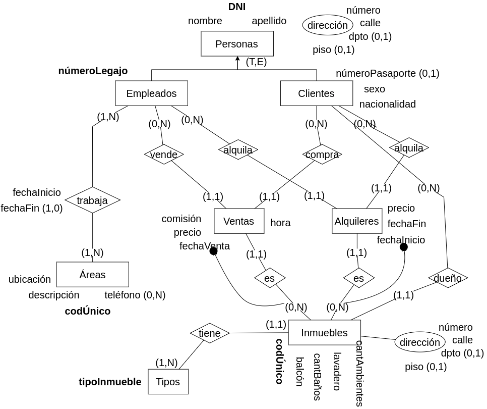
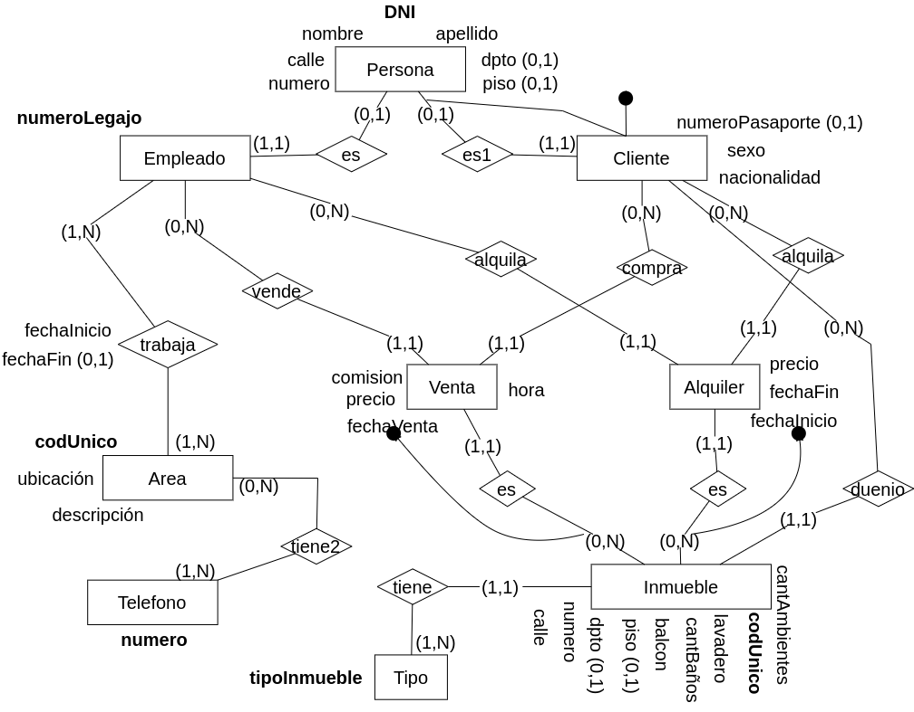

**1.** Se debe modelar la información necesaria para una Inmobiliaria de la ciudad de La Plata. 

Es necesario modelar la información de clientes y empleados de la inmobiliaria. De ambos se conoce D.N.I, nombre, apellido y dirección detallada. Además de los empleados se conoce el número de legajo, el cual no se repite entre diferentes empleados y el área donde trabaja cada uno. Los empleados pueden ir rotando de área a lo largo del tiempo y es necesario modelar por las distintas áreas que pasó un empleado. De las áreas se conoce código único de área, descripción, teléfonos y ubicación. De cada cliente, además, se debe almacenar sexo, nacionalidad, número de pasaporte (si tuviera) y los inmuebles de los que es dueño. Un cliente no puede trabajar en la inmobiliaria.

La inmobiliaria maneja diferentes inmuebles de los cuales se conoce dirección detallada, código único de inmueble, cantidad de ambientes, si posee balcón, si posee lavadero, cantidad de baños, si se alquila, se vende o ambas cosas, precio de venta y precio de alquiler, tipo de inmueble (casa, duplex, depto,...). 

Debe quedar registrado todo alquiler y venta que realiza la inmobiliaria detallando, para los alquileres inmueble, cliente, fechas de inicio y fin de alquiler, empleado que alquiló y precio.
De las ventas se registran fecha y hora de venta, cliente, empleado que vendió la propiedad, precio de venta y comisión de venta. 

Nota: tenga en cuenta que podría pedirse promedio de ventas de un semestre del año, vendedor más exitoso del año, tipo de inmueble más alquilado o más vendido entre otros.

### Modelo ER Conceptual

### Modelo ER Lógico

### Modelo Físico Relacional

PERSONA = (<u>DNI</u>, nombre, apellido, calle, numero, dpto?, piso?)

EMPLEADO = (<u>nroLegajo</u>, DNI(fk))

CLIENTE = (<u>DNI</u>, nacionalidad, sexo, numeroPasaporte?)

AREA = (<u>codUnico</u>, descripcion, ubicacion)

TELEFONO (<u>numero</u>)

VENTA = (<u>fechaVenta, codUnico</u>, numeroLegajo(fk), DNI(fk), comision, precio, hora)

ALQUILER = (<u>fechaInicio, codUnico</u>, numeroLegajo(fk), DNI(fk), fechaFin, precio)

TIPO = (<u>tipoInmueble</u>)

INMUEBLE = (<u>codUnico</u>, tipoInmueble(fk), cantAmbientes, lavadero, cantBanios, balcon, piso?, dpto?, numero, calle)

TIENE2 = (<u>numero, codUnico</u>)

TRABAJA = (<u>nroLegajo, codUnico</u>, fechaInicio, fechaFin?)

<u>x</u>

